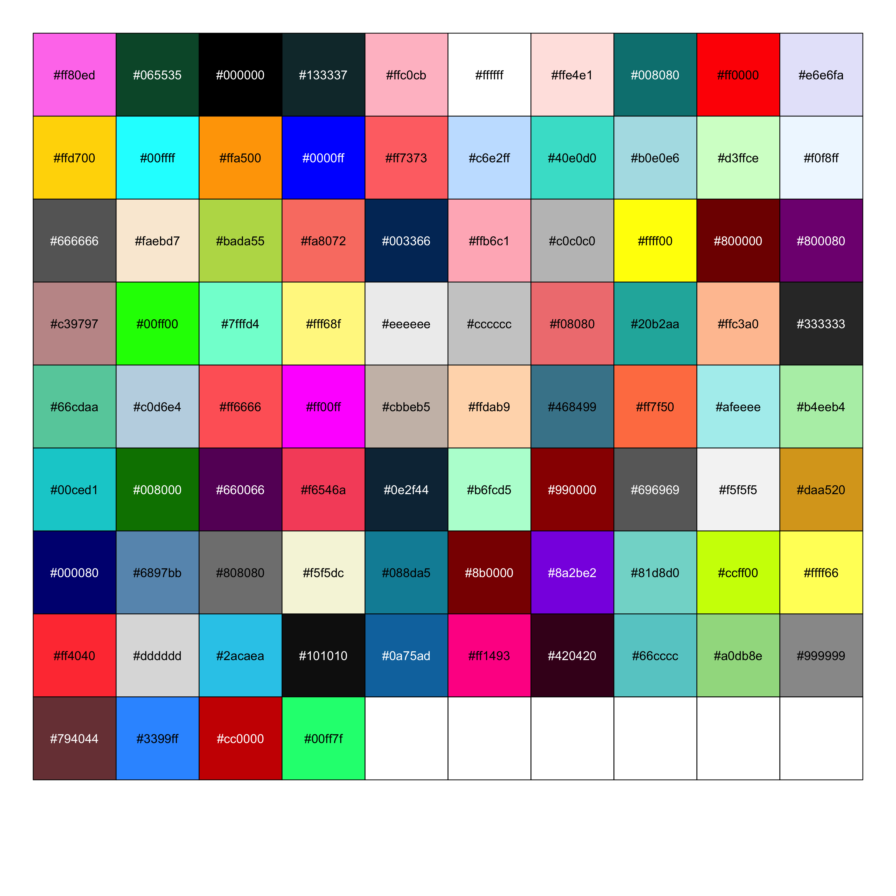

<!-- README.md is generated from README.Rmd. Please edit that file -->

# colorhex

<!-- badges: start -->

[](https://github.com/Athanasiamo/colorhex/actions)
[](https://CRAN.R-project.org/package=colorhex)
<!-- badges: end -->

The goal of colorhex is to create an interface to
[www.color-hex.com](www.color-hex.com), a website with hexidecimal
colors and information about them. It also has lots of user-made
palettes that can be used and browsed.

## Installation

<!-- You can install the released version of colorhex from [CRAN](https://CRAN.R-project.org) with: -->

<!-- ``` r -->

<!-- install.packages("colorhex") -->

<!-- ``` -->

You can install the development version from
[GitHub](https://github.com/) with:

``` r
# install.packages("devtools")
devtools::install_github("Athanasiamo/colorhex")
```

## Example

### Single colors

``` r
library(colorhex)

x <- get_color("#470f0f")
x
#> # Color-hex: #470f0f
#> RGB: 71, 15, 15
#> HSL: 0.00, 0.65, 0.17
#> CMYK: 0.00, 0.79, 0.79   0.72
#> triadic: #0f470f, #0f0f47
#> complementary: #0f4747
plot(x)
```


``` r
x <- get_popular_colors()
x
#>  [1] "#696969" "#bada55" "#7fe5f0" "#ff0000" "#ff80ed" "#407294" "#cbcba9"
#>  [8] "#ffffff" "#420420" "#133337" "#065535" "#c0c0c0" "#5ac18e" "#000000"
#> [15] "#666666" "#dcedc1" "#f7347a" "#576675" "#ffc0cb" "#ffe4e1" "#696966"
#> [22] "#008080" "#ffd700" "#e6e6fa" "#ffa500" "#00ffff" "#ff7373" "#40e0d0"
#> [29] "#0000ff" "#f0f8ff" "#d3ffce" "#b0e0e6" "#c6e2ff" "#faebd7" "#003366"
#> [36] "#fa8072" "#ffff00" "#7fffd4" "#ffb6c1" "#800000" "#c39797" "#800080"
#> [43] "#f08080" "#00ff00" "#eeeeee" "#fff68f" "#cccccc" "#ffc3a0" "#333333"
#> [50] "#20b2aa" "#66cdaa" "#ff6666" "#ff00ff" "#ffdab9" "#4ca3dd" "#c0d6e4"
#> [57] "#468499" "#ff7f50" "#f6546a" "#afeeee" "#008000" "#660066" "#cbbeb5"
#> [64] "#00ced1" "#b6fcd5" "#0e2f44" "#088da5" "#990000" "#b4eeb4" "#daa520"
#> [71] "#f5f5f5" "#101010" "#808080" "#8b0000" "#6897bb" "#ffff66" "#000080"
#> [78] "#81d8d0" "#f5f5dc" "#ccff00" "#ff4040" "#dddddd" "#66cccc" "#8a2be2"
scales::show_col(x)
```



### Palettes

``` r
latest <- get_latest_palettes()
plot(latest)
```


``` r
popular <- get_popular_palettes()
plot(popular)
```


