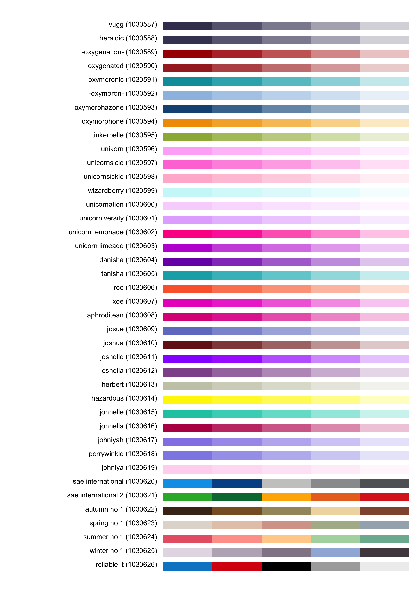

<!-- README.md is generated from README.Rmd. Please edit that file -->

# colorhex

<!-- badges: start -->

[](https://github.com/Athanasiamo/colorhex/actions)
[](https://CRAN.R-project.org/package=colorhex)
<!-- badges: end -->

The goal of colorhex is to create an interface to
[color-hex.com](https://www.color-hex.com/), a website with hexidecimal
colors and information about them.

It also has lots of user-made palettes that can be used and browsed.

## Installation

<!-- You can install the released version of colorhex from [CRAN](https://CRAN.R-project.org) with: -->
<!-- ``` r -->
<!-- install.packages("colorhex") -->
<!-- ``` -->

You can install the development version from
[GitHub](https://github.com/) with:

``` r
# install.packages("devtools")
devtools::install_github("Athanasiamo/colorhex", ref = "main")
```

## Example

### Single colors

``` r
library(colorhex)

x <- get_color("#470f0f")
x
#> # Color-hex: #470f0f
#> RGB: 71, 15, 15
#> HSL: 0.00, 0.65, 0.17
#> CMYK: 0.00, 0.79, 0.79   0.72
#> triadic: #0f470f, #0f0f47
#> complementary: #0f4747
#> used in 2 palettes
plot(x)
```


``` r
x <- get_popular_colors()
x
#>  [1] "#0ff1ce" "#696969" "#bada55" "#7fe5f0" "#ff0000" "#ff80ed" "#407294"
#>  [8] "#ffffff" "#cbcba9" "#420420" "#133337" "#065535" "#c0c0c0" "#000000"
#> [15] "#5ac18e" "#666666" "#dcedc1" "#f7347a" "#576675" "#ffc0cb" "#ffe4e1"
#> [22] "#008080" "#696966" "#ffd700" "#e6e6fa" "#ffa500" "#8a2be2" "#ff7373"
#> [29] "#00ffff" "#40e0d0" "#0000ff" "#f0f8ff" "#d3ffce" "#c6e2ff" "#b0e0e6"
#> [36] "#faebd7" "#fa8072" "#003366" "#ffff00" "#ffb6c1" "#800000" "#800080"
#> [43] "#f08080" "#7fffd4" "#c39797" "#fff68f" "#eeeeee" "#00ff00" "#cccccc"
#> [50] "#ffc3a0" "#20b2aa" "#333333" "#ac25e2" "#66cdaa" "#ff6666" "#ffdab9"
#> [57] "#ff00ff" "#ff7f50" "#c0d6e4" "#4ca3dd" "#468499" "#047806" "#008000"
#> [64] "#f6546a" "#afeeee" "#cbbeb5" "#660066" "#00ced1" "#b6fcd5" "#990000"
#> [71] "#daa520" "#0e2f44" "#808080" "#088da5" "#b4eeb4" "#8b0000" "#6897bb"
#> [78] "#f5f5f5" "#101010" "#000080" "#f5f5dc" "#ffff66" "#81d8d0" "#0a75ad"
scales::show_col(x)
```


### Palettes

``` r
latest <- get_latest_palettes()
plot(latest)
```



``` r
popular <- get_popular_palettes()
plot(popular)
```


### ggplot2 scales

``` r
library(ggplot2)

ggplot(mtcars, aes(mpg)) +
   geom_density(aes(fill = disp, group = disp)) +
   scale_fill_palettehex_c(popular)
```


``` r
ggplot(mtcars, aes(mpg)) +
  geom_density(aes(fill = disp, group = disp)) +
  scale_fill_palettehex_c(popular, 3)
```


``` r
ggplot(mtcars, aes(mpg, disp, colour = factor(cyl))) +
   geom_point() +
   scale_color_palettehex_d(popular)
```


``` r
ggplot(mtcars, aes(mpg, disp, colour = factor(cyl))) +
   geom_point() +
   scale_color_palettehex_d(popular, 1872)
```


``` r
x <- get_color("#008080")

ggplot(mtcars, aes(mpg)) +
   geom_density(aes(fill = disp, group = disp)) +
   scale_fill_colorhex_c(x)
```


``` r
ggplot(mtcars, aes(mpg)) +
  geom_density(aes(fill = disp, group = disp)) +
  scale_fill_colorhex_c(x, "tints")
```


``` r
ggplot(mtcars, aes(mpg)) +
  geom_density(aes(fill = disp, group = disp)) +
  scale_fill_colorhex_c(x, "shades")
```


``` r
ggplot(mtcars, aes(mpg, disp, colour = factor(cyl))) +
   geom_point() +
   scale_color_colorhex_d(x, "triadic")
```


``` r
ggplot(mtcars, aes(mpg, disp, colour = factor(cyl))) +
   geom_point() +
   scale_color_colorhex_d(x, "shades")
```


