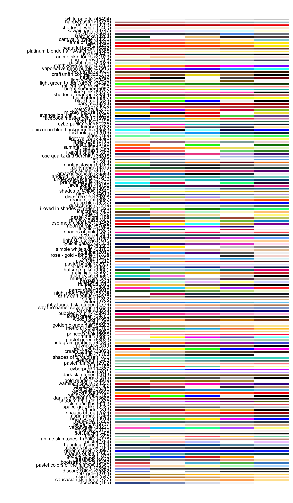

<!-- README.md is generated from README.Rmd. Please edit that file -->

# colorhex

<!-- badges: start -->

[](https://CRAN.R-project.org/package=colorhex)
[](https://github.com/Athanasiamo/colorhex/actions)
[](https://github.com/Athanasiamo/colorhex/actions/workflows/R-CMD-check.yaml)
<!-- badges: end -->

The goal of colorhex is to create an interface to
[color-hex.com](https://www.color-hex.com/), a website with hexidecimal
colors and information about them.

It also has lots of user-made palettes that can be used and browsed.

## Installation

<!-- You can install the released version of colorhex from [CRAN](https://CRAN.R-project.org) with: -->
<!-- ``` r -->
<!-- install.packages("colorhex") -->
<!-- ``` -->

You can install the development version from
[GitHub](https://github.com/) with:

``` r
# install.packages("devtools")
devtools::install_github("Athanasiamo/colorhex", ref = "main")
```

## Example

### Single colors

``` r
library(colorhex)

x <- get_color("#470f0f")
x
#> # Color-hex: #470f0f
#> RGB: 71, 15, 15
#> HSL: 0.00, 0.65, 0.17
#> CMYK: 0.00, 0.79, 0.79   0.72
#> triadic: #0f470f, #0f0f47
#> complementary: #0f4747
#> used in 2 palettes
plot(x)
```


``` r
x <- get_popular_colors()
x
#>  [1] "#ff80ed" "#065535" "#000000" "#133337" "#ffc0cb" "#ffffff" "#ffe4e1"
#>  [8] "#008080" "#ff0000" "#e6e6fa" "#ffd700" "#00ffff" "#ffa500" "#0000ff"
#> [15] "#ff7373" "#c6e2ff" "#40e0d0" "#b0e0e6" "#d3ffce" "#f0f8ff" "#666666"
#> [22] "#faebd7" "#bada55" "#003366" "#fa8072" "#ffb6c1" "#ffff00" "#c0c0c0"
#> [29] "#c39797" "#800080" "#800000" "#00ff00" "#7fffd4" "#eeeeee" "#cccccc"
#> [36] "#fff68f" "#f08080" "#20b2aa" "#ffc3a0" "#333333" "#66cdaa" "#c0d6e4"
#> [43] "#ff6666" "#ff00ff" "#cbbeb5" "#ffdab9" "#ff7f50" "#468499" "#afeeee"
#> [50] "#008000" "#b4eeb4" "#00ced1" "#f6546a" "#660066" "#0e2f44" "#b6fcd5"
#> [57] "#696969" "#daa520" "#f5f5f5" "#990000" "#6897bb" "#000080" "#808080"
#> [64] "#088da5" "#f5f5dc" "#8b0000" "#8a2be2" "#dddddd" "#ccff00" "#ffff66"
#> [71] "#2acaea" "#101010" "#81d8d0" "#0a75ad" "#ff4040" "#66cccc" "#420420"
#> [78] "#a0db8e" "#ff1493" "#cc0000" "#3399ff" "#999999" "#00ff7f" "#794044"
scales::show_col(x)
```


### Palettes

``` r
latest <- get_latest_palettes()
plot(latest)
```


``` r
popular <- get_popular_palettes()
plot(popular)
```



### ggplot2 scales

``` r
library(ggplot2)

ggplot(mtcars, aes(mpg)) +
   geom_density(aes(fill = disp, group = disp)) +
   scale_fill_palettehex_c(popular)
```


``` r

ggplot(mtcars, aes(mpg)) +
  geom_density(aes(fill = disp, group = disp)) +
  scale_fill_palettehex_c(popular, 3)
```


``` r

ggplot(mtcars, aes(mpg, disp, colour = factor(cyl))) +
   geom_point() +
   scale_color_palettehex_d(popular)
```


``` r

ggplot(mtcars, aes(mpg, disp, colour = factor(cyl))) +
   geom_point() +
   scale_color_palettehex_d(popular, 1872)
```


``` r
x <- get_color("#008080")

ggplot(mtcars, aes(mpg)) +
   geom_density(aes(fill = disp, group = disp)) +
   scale_fill_colorhex_c(x)
```


``` r

ggplot(mtcars, aes(mpg)) +
  geom_density(aes(fill = disp, group = disp)) +
  scale_fill_colorhex_c(x, "tints")
```


``` r

ggplot(mtcars, aes(mpg)) +
  geom_density(aes(fill = disp, group = disp)) +
  scale_fill_colorhex_c(x, "shades")
```


``` r

ggplot(mtcars, aes(mpg, disp, colour = factor(cyl))) +
   geom_point() +
   scale_color_colorhex_d(x, "triadic")
```


``` r

ggplot(mtcars, aes(mpg, disp, colour = factor(cyl))) +
   geom_point() +
   scale_color_colorhex_d(x, "shades")
```


